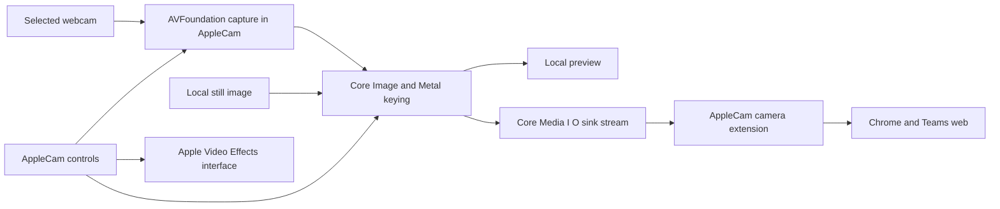

# AppleCam architecture proposal

Prepared on 2 October 2026. This is the proposed architecture to validate during M0. The M0 app and extension now compile, and the local synthetic preview runs. Local BRIO capture and the first green-screen preview have now been exercised. Extension activation and browser delivery remain unproven for AppleCam.

## Components and data flow

Use a Swift native menu-bar app with a separate embedded Core Media I/O Camera Extension. The app owns the selected webcam, settings, preview and image processing. The extension receives finished frames and publishes a single selectable camera.



This host-app capture choice is intentional: it gives the foreground user a clear capture identity and places native controls, file import and GPU preview in the app. Its exact behavior with Apple effects is an M0 question. Direct capture inside an extension is a supported Apple pattern, but is not an automatic alternative implemented by this plan.

Apple's framework supports source streams, which produce buffers, and sink streams, which consume buffers from an app. Sending frames into a sink uses the Core Media I/O C API; AVFoundation alone does not provide that output API. This transport is a required part of M0, not a trivial file or shared-memory shortcut. [Apple camera-extension session](https://developer.apple.com/videos/play/wwdc2022/10022/).

## Apple integration

| Layer | Proposed use | Boundary |
| --- | --- | --- |
| AVFoundation | Camera discovery, selected input and sample delivery | AppleCam still configures sessions and handles disconnects |
| Core Image with Metal | GPU processing and compositing | Keying and spill policy are AppleCam behavior |
| Core Media I/O | Published camera, sink input and source output | AppleCam implements provider, device and stream contracts |
| SystemExtensions | Activation, replacement and deactivation | Registration success does not prove the extension is running |
| Apple Video Effects UI | Open existing system controls from the app | No custom controls are inserted into Apple's panel |

Use `AVCaptureDevice.showSystemUserInterface(.videoEffects)` for the system panel. Local SDK declarations confirm macOS availability, and a compile-only probe passed. Relevant Background Replacement and Portrait enabled-state properties are read-only; active device properties can be observed. The app must guide the user rather than attempt to set unsupported Apple flags.

AppleCam processes every valid input frame regardless of active Apple effects. It does not read effect state to gate preview, sampling or publication. Effects on the receiving browser or virtual camera are a separate processing stage chosen by the user. Do not claim the host can control another application's effect settings.

## Capture and processing

Bind the input to the user's selected device identifier. Enumerate capabilities, verify the chosen 1080p 30 fps format and explicitly configure it. Exclude AppleCam's published device from input choices to prevent feedback loops.

Keep sample callbacks short. Retain only the buffers needed for pending processing, use a reusable pixel-buffer pool and avoid a growing backlog. Generate complete opaque output frames in a declared output format, provisionally 32-bit BGRA with an explicit SDR colour-space contract. Input decoding, orientation and colour conversion must be tested against the actual BRIO formats before output parameters are fixed.

The processing chain is input normalization, colour-distance key, soft alpha matte, spill suppression and background composite. Use a Metal-backed Core Image context and explicit colour management. Apple's `CIColorCube` recipe is a useful starting reference, but a binary lookup table does not meet the quality requirement by itself. Preserve fractional alpha during processing and emit opaque composite output to the meeting app. [Apple chroma-key recipe](https://developer.apple.com/library/archive/documentation/GraphicsImaging/Conceptual/CoreImaging/ci_filer_recipes/ci_filter_recipes.html).

The CPU reference and GPU implementation must use the same formulas and colour-space assumptions. Tune glass transmission and reflected green independently. A preview sampler must correctly map displayed coordinates through scaling, cropping and optional mirroring to the sampled source colour.

## Frame transport and timing

Use a sink and source stream within the extension. The host submits sample buffers to the sink through the public CMIO queue APIs. The extension consumes those buffers, validates format and timing, acknowledges consumption as required and publishes them to source consumers. Exact ownership and callback ordering must be established in M0.

Bound the pending queue to a proposed maximum of two frames and prefer fresh frames over accumulated latency. A dropped frame increments a counter; it must not trigger automatic resolution or frame-rate changes. Preserve a common monotonic timing basis, correct presentation timestamps and sequence numbers for diagnostics. Reject expired input rather than replaying the last frame continuously.

The extension shares source delivery across supported clients. Track external consumer demand separately from preview demand and output-enabled state. Close and open events can overlap; serialise state transitions and unit-test race sequences through a transport abstraction.

The proposed performance measurement starts when the host receives an input sample and ends when the extension submits the resulting frame to its source stream. This does not measure sensor latency, browser rendering, Teams encoding or network delivery. A separate receiver comparison is needed to estimate the user-visible additional local delay.

## State model

| State | Capture behavior | Publication behavior |
| --- | --- | --- |
| Disabled | Off unless an explicit local preview is active | No frames to external consumers |
| Ready | Off until a consumer or explicit preview requests input | Camera is enumerated; no fabricated image is emitted |
| Previewing | Selected camera and processor run for preview | Publishes only if output is also enabled and has consumers |
| Streaming | One shared capture and processing pipeline runs | Valid composite frames go to active consumers |
| Unavailable | Capture is stopped where possible | Stop frames and show the specific cause |

The model includes reason codes for pending approval, missing input, denied permission, unsupported format, invalid background and extension activation failure. Saved settings do not restore active capture automatically on app launch. A future launch-at-login feature is outside the initial release unless requested.

On host termination, the extension must stop accepting and publishing camera frames after detecting the lost producer. It must not continue a stale-frame loop. A client may cache an already received picture; stopping AppleCam cannot remove that copy. The UX should describe stopping capture accurately.

## Settings and storage

Keep a versioned settings document in the user's app container. Store the selected camera identifier, background asset reference, key colour, tolerance, softness, spill strength and preview mirror preference. Validate ranges and asset existence before enabling output.

Import background images through the macOS file picker and copy approved assets into local app-managed storage, avoiding an extension dependency on arbitrary user file paths. No camera frame is stored by default. The extension receives composited buffers, not background file paths or account details.

Communication for settings and status should use a small explicit protocol over supported extension property mechanisms and CMIO callbacks. Do not assume the extension, which runs under a role account, can use the host user's ordinary preferences or connect to arbitrary foreground services. An app-group entitlement does not remove the camera extension's sandbox restrictions. Validate any necessary shared-container access before selecting it.

## Installation and diagnostics

Package the extension inside the app bundle and activate it through SystemExtensions from Applications. Use matching team signatures and the required entitlements. The host needs camera access and the ability to activate its extension; the extension needs its camera-provider and sandbox declarations. M0 must inspect the actual generated and signed entitlements rather than copy an untested list from this proposal.

For the intended SIP-enabled installation route, sign and notarize the app and extension. Keep credentials in Apple tooling and the keychain. [Apple System Extensions requirements](https://developer.apple.com/documentation/systemextensions/).

Show separate status for installed, approved, process available, source stream available and frames delivered. Do not treat the system's active and enabled registration as a complete health check. Record sanitized error codes and timing counters through local diagnostics; never log image data, account identifiers or signing secrets.

## Planned source layout

```text
AppleCam.xcodeproj/
AppleCam/
  App/
  Capture/
  Processing/
  Settings/
  Transport/
AppleCamCameraExtension/
Shared/
Tests/
  Unit/
  GPU/
  Integration/
  Fixtures/
docs/
artifacts/
  verification/
  benchmarks/
  private/
work/
```

The initial implementation uses `AppleCam/App`, `AppleCam/Capture`, `AppleCam/Transport`, `AppleCamCameraExtension`, `Shared`, `Tests/Unit` and `Tests/Media`. The processing module is now in `AppleCam/Processing`, with the CPU reference in `Shared/ChromaKey.swift` and GPU tests in `Tests/Media`. Persistent settings remain future work. Shared code should contain value types and contracts that can be unit-tested independently of camera permission and extension activation. Begin with the native Apple frameworks; no third-party runtime dependency is currently proposed.

## M0 implementation notes

The prototype publishes only after an explicit diagnostic start. The host queue admits at most two pending frames, drops briefly under backpressure and raises an error after two seconds without queue space. The extension expires input older than 150 ms and never generates a substitute frame. The source and sink UUIDs are stable. Producer authorization checks the CMIO signing identifier and a dynamic Security framework requirement for the same Apple signing team. These native transport and authorization paths compile but still require signed integration validation.

The `CaptureDemand` reducer is tested but not wired to host consumer notifications yet. M0 keeps explicit preview/transport sessions alive until Stop; M2 must connect external demand and preview visibility before idle behavior can pass acceptance. No milestone is passed by the local preview alone.

## First green-screen implementation

`GreenScreenProcessor` compiles one public Metal compute shader per processing session and reuses its command queue, pipeline and texture cache. Core Image normalizes the input to sRGB BGRA and prepares the imported, orientation-corrected background once. Image import decodes PNG/JPEG to at most 4096 pixels on the long edge, then centres an aspect-fill crop to 1920 × 1080. Visible transparency is rejected. The sandbox entitlement grants read-only access to user-selected files; the image is decoded during the file access grant; build 11 also copies the imported file into the app’s private Application Support directory for restoration.

The matte uses Euclidean distance between normalized RGB chromaticities, a tolerance threshold and smoothstep softness. Black remains opaque. The GPU then subtracts the sampled screen contribution in linear sRGB, clamps premultiplied foreground to the matte alpha, reduces excess green, and composites over the background. This is a tunable colour key, not a physical reconstruction of arbitrary tinted or reflective lenses. The CPU reference applies the same equations for independent fixtures and parity checks; it is never used as a processing fallback.

The GPU completion is awaited on the capture queue before handing out the destination buffer. CVMetalTexture wrappers stay alive until completion. The reusable pixel-buffer pool retains at most five allocated surfaces during delivery, including the latest normalized raw buffer used only for sampling. The CMIO queue remains bounded at two. The preview is made from the same processed output buffer that is packaged for transport; processing errors stop capture before raw delivery. Capture timestamps are converted from the session synchronization clock to host time before processing; their capture instant and age are preserved, together with colour attachments. The host drops isolated expired frames and stops after two seconds of continuously expired frames. The extension independently rejects any frame older than 150 ms.

The unmirrored preview is exactly 16:9, so normalized top-left tap coordinates map directly to normalized BGRA rows; sampling averages a clipped 5 × 5 patch. It samples the latest camera frame before keying, without switching the preview or outgoing stream to raw. Key parameters update on the serial capture queue. Changing image or processing mode requires stopping first. Persistence and consumer-demand behavior remain M2 work.

Clock reference: [Apple AVCaptureSession.synchronizationClock](https://developer.apple.com/documentation/avfoundation/avcapturesession/synchronizationclock) specifies that all capture output timestamps use the session clock. AppleCam converts them to the host clock used by its CMIO stream and freshness checks.

## Calibration processing (build 8)

Each frame uses two Metal passes. The first chooses the closest of at most six chromaticity samples and generates an R32Float alpha texture. A bounded foreground-protection control raises opacity for near-neutral colours and dark colours with weak relative green excess. Strongly green pixels remain eligible for keying even when dark. The second pass optionally fills pixels enclosed by a solid 5×5 perimeter, composites using the nearest screen colour, and writes an independent local mask buffer only when selected. Hole filling defaults off and can fill real mesh apertures; it is not semantic reconstruction. All intermediate surfaces are reused.

The host always packages the composited buffer for CMIO before separately choosing the local preview. KeyPreview cannot select a transport payload. FrameTransport provides an injectable boundary for testing this invariant with actual sample-buffer pixels. The runtime concrete transport remains SinkTransport; there is no alternative runtime path. Colour sampling always reads the latest original camera buffer.

### Build 10 live mode transitions

Keyer/background replacement and publishing changes execute on the same serial queue as frame production. Explicit disable removes the keyer and resets local mask view; enable builds a validated Metal processor before assignment. Processing errors stop delivery. Destination changes start/stop the existing transport without restarting capture. Apple effects never suppress frame delivery or clear preview/sampling state. The former effect-state dependency and paused state were removed in build 10. No clock rebasing or frame admission changes are involved.

The effects panel request is made on the main thread after the selected physical camera's first frame, with AppleCam active. Starting that flow from stopped requests only local preview. Programmatic effect toggles remain unsupported; macOS owns the panel and the user makes the changes. Pure UI/macOS panel presentation is an integration check, not unit-testable through this app's public API. Producer tests verify continuous processed publication, preview and sampling during calibration. Actual OS effects are read-only system state and require live integration verification; there is no effect adapter or synthetic effect gate in production.

### Automatic preferences (build 11)

CameraModel is a separate, testable host component. Property observers persist a versioned Codable SavedPreferences snapshot synchronously on each user edit, avoiding a quit-time debounce race. PreferencesStore writes the small JSON snapshot atomically. Background import writes a new UUID-named managed image before committing its reference; failed commits remove the new copy, and successful replacement cleans up the previous managed image. Slider changes do not rewrite image bytes. Original names are display metadata and never used as storage paths. The sandbox resolves Application Support inside the app container; no extra file-access entitlement or security-scoped bookmark is needed after import.

Restoration suppresses autosave observers until the validated snapshot has been applied. Capture, publication, in-flight UI state and camera frames are never serialized. Invalid schema/settings block capture and require explicit replacement; missing background assets retain the requested green-screen mode and require reimport before starting it. A missing camera ID remains selected instead of choosing a substitute. Save errors stay visible separately from stream status. Apple's effect choices are not changed by restoration.
